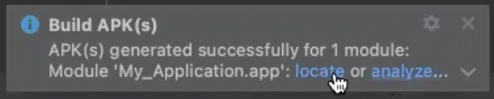

# Symbl Agora Demo App

[](https://docs.symbl.ai/docs/streamingapi/overview/introduction)

Symbl's APIs empower developers to enable: 
- **Real-time** analysis of free-flowing discussions to automatically surface highly relevant summary discussion topics, contextual insights, suggestive action items, follow-ups, decisions, and questions.\
- **Voice APIs** that makes it easy to add AI-powered conversational intelligence to either [telephony][telephony] or [WebSocket][websocket] interfaces.
- **Conversation APIs** that provide a REST interface for managing and processing your conversation data.
- **Summary UI** with a fully customizable and editable reference experience that indexes a searchable transcript and shows generated actionable insights, topics, timecodes, and speaker information.

<hr />

## Enable Symbl's Extension for Agora Video Calls in Android

<hr />

 * [Introduction](#introduction)
 * [Pre-requisites](#pre-requisites)
 * [Setup and Deploy](#setupanddeploy)
 * [Dependencies](#dependencies)
 * [Conclusion](#conclusion)
 * [Community](#community)

## Introduction

The Android app is a sample application designed to demonstrate how you implement Symbl.ai's Conversation Intelligence APIs into an Android application with Agora.io.

### Pre-requisites

* Android Studio 3.3 or above
* Android device (e.g. Nexus 5X). A real device is recommended because some simulators have missing functionality or lack the performance necessary to run the sample. You will not be able to deploy the app to the Android Studio's emulator, since the emulator does not simulate access to hardware such as the camera or the microphone.
* Java 11
* Android API Level 29
* Symbl.ai account from [Symbl][signup]'s platform.
* Agora Account [Agora](https://sso.agora.io/en/v3/signup)

## Setup and Deploy
1. The first step is to navigate to Agora.io's [console][console] where you sign up for a free developer account. After signing up on the console, navigate to Symbl.ai's Extension in Agora.io's Extension [Marketplace](https://console.agora.io/marketplace). Activate the app.

2. The second step to getting setup is to [sign up][signup] on both platforms, [Symbl][signup]'s and [Agora](https://sso.agora.io/en/v3/signup)'s. 

3. The third step is to clone the repo. Here is the link: 

```bash
git clone git@github.com:symblai/symbl-agora-Android-app.git
```

7. The fourth step is to update the `strings.xml` file with values for the following:

Add your credentials for Symbl.ai here:
*  `symbl_app_id`
*  `symbl_app_secret`

Add your credentials for Agora.io here:
*  `agora_customer_app_id`
*  `agora_token_value`

5. The fifth step is to build your app is to navigate from Build -> Make Project. It will download all of the dependencies listed in the `build.gradle`, all of which are pre-loaded into the sample app. 

6. The sixth step is to export the `.apk` to your phone. Navigate from Build -> Build Bundle(s) / APK. You will receive the following message:



After updating those strings with values, the next step is to build the project. 

## Dependencies
There is a dependency you should update according to the location of your download for the the `agora-symblai-filter-debug.aar`. Navigate to the `build.gradle` file where there is line within the dependencies for an `implementation files()`. Update the path to your own path. 

```Java
implementation files('/Users/User/Desktop/Symbl/Docs/Agora/Depedencies/agora-symblai-filter-debug.aar')
```

## Conclusion 

Symbl.ai's Extension for the Agora.io marketplace ensures developers have the power to create Android apps with features from its Conversation Intelligence API platform. 

Although Symbl.ai's Extension is operative for Android, Symbl.ai is open to contributions from the community for iOS. Symbl.ai, however, does have a web app for Agora.io that welcomes contributions from the community. 

## Community

If you have any questions, feel free to reach out to us at devrelations@symbl.ai or thorugh our [Community Slack][slack].

This guide is actively developed, and we love to hear from you! Please feel free to [create an issue][issues] or [open a pull request][pulls] with your questions, comments, suggestions and feedback.  If you liked our integration guide, please star our repo!

This library is released under the [MIT License][license]

[license]: LICENSE.txt
[telephony]: https://docs.symbl.ai/docs/telephony/overview/post-api
[websocket]: https://docs.symbl.ai/docs/streamingapi/overview/introduction
[console]: https:console.agora.io
[slack]: https://join.slack.com/t/symbldotai/shared_invite/zt-4sic2s11-D3x496pll8UHSJ89cm78CA
[signup]: https://platform.symbl.ai/?_ga=2.90794201.232722623.1641351522-1406598850.1641351522#/signup
[issues]: https://github.com/symblai/symbl-agora-Android-app/issues
[pulls]: https://github.com/symblai/symbl-agora-Android-app/pulls