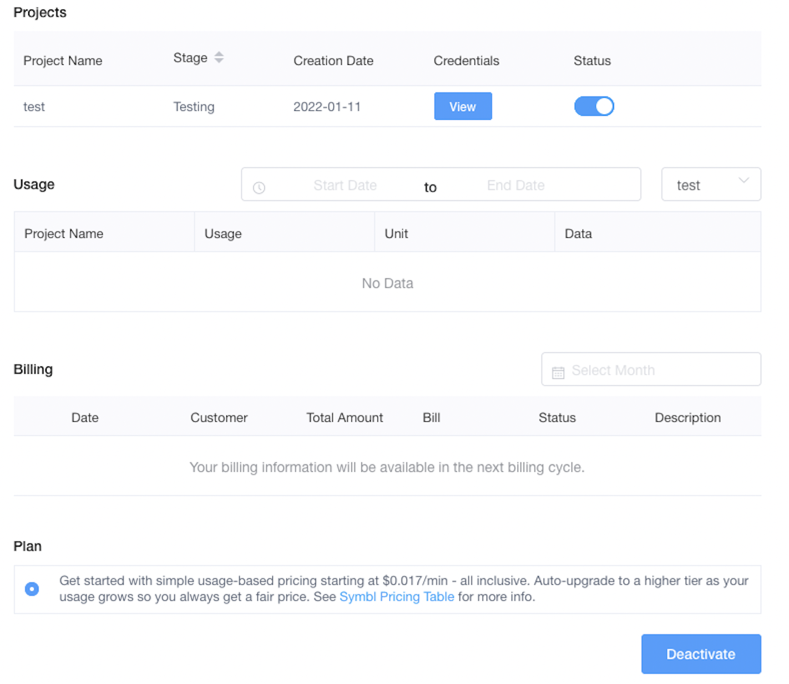

# Symbl Agora Demo App

[](https://docs.symbl.ai/docs/streamingapi/overview/introduction)

Symbl's APIs empower developers to enable: 
- **Real-time** analysis of free-flowing discussions to automatically surface highly relevant summary discussion topics, contextual insights, suggestive action items, follow-ups, decisions, and questions.
- **Voice APIs** that makes it easy to add AI-powered conversational intelligence to either [telephony][telephony] or [WebSocket][websocket] interfaces.
- **Conversation APIs** that provide a REST interface for managing and processing your conversation data.
- **Summary UI** with a fully customizable and editable reference experience that indexes a searchable transcript and shows generated actionable insights, topics, timecodes, and speaker information.

<hr />

## Enable Symbl's Extension for Agora Video Calls in Android

<hr />

 * [Introduction](#introduction)
 * [Pre-requisites](#pre-requisites)
 * [Setup and Deploy](#setup-and-deploy)
 * [Dependencies](#dependencies)
 * [Conclusion](#conclusion)
 * [Community](#community)

## Introduction

Through its partnership with Agora.io, Symbl.ai provides developers a Symbl.ai [Extension][symbl_extension] in the Agora.io Extension's [Marketplace][marketplace]. The Symbl.ai Extension enables Android developers to transform their existing Agora.ios voice, video, or text messaging apps into the next level of bleeding edge technology with Symbl.ai's Conversation Intelligence APIs. 

In an effort to assist developers with digitally transforming their Agora.io voice, video or text messaging apps with Symbl.ai's Conversation Intelligence APIs, Symbl.ai is hosting the following Android app, which is a sample application designed to demonstrate how you implement Symbl.ai's Conversation Intelligence APIs into an Android application with Agora.io.

It is merely for demonstration purposes only but any one is free to refactor the application for their own particular use-cases. 

### Pre-requisites

* Android Studio 3.3 or above
* Android device (e.g. Pixel 5). A real device is recommended instead of emulator.
* Android API Level 29+
* [Agora](https://sso.agora.io/en/v3/signup) Account

## Setup and Deploy
1. The first step is to navigate to Agora.io's [console][console] where you sign up for a free developer account. After signing up on the console, navigate to Symbl.ai's Extension in Agora.io's Extension [Marketplace][marketplace], which re-routes you directly to Agora.io's [console][console]. 

2. The second step to getting setup is to create and activate your project. Upon activating your project, Agora.io automatically retrieves the Symbl.ai appId and appSecret required to be used in your own app. To fetch those credentials, press on the "View" button in your project.



3. The third step is to clone the repo. Here is the link: 

```bash
git clone git@github.com:symblai/symbl-agora-Android-app.git
```
4. The fourth step is to update the `strings.xml` file with values for the following:

Add your credentials for Symbl.ai here:
*  `symbl_app_id`
*  `symbl_app_secret`

Add your credentials for Agora.io here:
*  `agora_customer_app_id`
*  `agora_token_value`

5. The fifth step is to build your app is to navigate from Build -> Make Project. It will download all of the dependencies listed in the `build.gradle`, all of which are pre-loaded into the sample app. 

6. The sixth step is to deploy to your Android device directly in the Run/Debug list of available devices.

## Dependencies

Since the sample app comes pre-loaded with all of its dependencies, you do not need to upload any dependencies. 

## Conclusion 

Symbl.ai's Extension for the Agora.io marketplace ensures developers have the power to create Android apps with features from its Conversation Intelligence API platform. 

## Community

If you have any questions, feel free to reach out to us at devrelations@symbl.ai or thorugh our [Community Slack][slack].

This guide is actively developed, and we love to hear from you! Please feel free to [create an issue][issues] or [open a pull request][pulls] with your questions, comments, suggestions and feedback.  If you liked our integration guide, please star our repo!

This library is released under the [MIT License][license]

[license]: LICENSE.txt
[telephony]: https://docs.symbl.ai/docs/telephony/overview/post-api
[websocket]: https://docs.symbl.ai/docs/streamingapi/overview/introduction
[console]: https:console.agora.io
[marketplace]: https://www.agora.io/en/agora-extensions-marketplace/
[symbl_extension]: https://www.agora.io/en/agora-extensions-marketplace/symbl-transcription-conversation-analytics/
[slack]: https://join.slack.com/t/symbldotai/shared_invite/zt-4sic2s11-D3x496pll8UHSJ89cm78CA
[signup]: https://platform.symbl.ai/?_ga=2.90794201.232722623.1641351522-1406598850.1641351522#/signup
[issues]: https://github.com/symblai/symbl-agora-Android-app/issues
[pulls]: https://github.com/symblai/symbl-agora-Android-app/pulls
